# Flux Dependency Flow Diagram

```mermaid
graph TB
    %% Sources Layer
    subgraph Sources["📦 Sources"]
        GitRepo["`**GitRepository**
        home-kubernetes
        (GitHub)`"]
        OCIRepo["`**OCIRepository**
        flux-manifests
        (OCI)`"]
        HelmRepos["`**26 HelmRepositories**
        (authentik, bjw-s, cilium, etc.)`"]
    end

    %% Root Kustomizations Layer
    subgraph Root["🔧 Root Kustomizations"]
        Cluster["`**cluster**
        Manages flux config`"]
        ClusterApps["`**cluster-apps**
        Manages all apps`"]
        FluxKust["`**flux**
        Manages Flux itself`"]
    end

    %% Infrastructure Foundation Layer
    subgraph Foundation["🏗️ Infrastructure Foundation"]
        OPConnect["`**onepassword-connect**
        Secret management`"]
        ExternalSecrets["`**external-secrets**
        Secret operator`"]
        SecretStore["`**external-secrets-secret-store**
        ClusterSecretStore`"]
        CertManager["`**cert-manager**
        Certificate management`"]
        CertIssuers["`**cert-manager-issuers**
        ClusterIssuers`"]
    end

    %% Core Infrastructure Layer
    subgraph CoreInfra["⚙️ Core Infrastructure"]
        Cilium["`**cilium**
        CNI`"]
        CiliumConfig["`**cilium-config**
        BGP/L2 policies`"]
        NFD["`**node-feature-discovery**
        Node features`"]
        NFDRules["`**node-feature-discovery-rules**
        Feature rules`"]
        ExternalDNS["`**external-dns-cloudflare**
        DNS management`"]
        ExternalDNSUnifi["`**external-dns-unifi**
        DNS management`"]
    end

    %% Storage Layer
    subgraph Storage["💾 Storage"]
        RookCeph["`**rook-ceph**
        Ceph operator`"]
        RookCluster["`**rook-ceph-cluster**
        Ceph cluster`"]
        VolSync["`**volsync**
        Volume sync`"]
        SnapshotCtrl["`**snapshot-controller**
        Snapshots`"]
    end

    %% Database Layer
    subgraph Database["🗄️ Database"]
        CNPG["`**cloudnative-pg**
        PostgreSQL operator`"]
        CNPGCluster["`**cloudnative-pg-cluster**
        Postgres cluster`"]
        Dragonfly["`**dragonfly**
        Redis operator`"]
        DragonflyCluster["`**dragonfly-cluster**
        Redis cluster`"]
    end

    %% Networking Layer
    subgraph Networking["🌐 Networking"]
        IngressCerts["`**ingress-nginx-certificates**
        TLS certs`"]
        IngressExt["`**ingress-nginx-external**
        External ingress`"]
        IngressInt["`**ingress-nginx-internal**
        Internal ingress`"]
        Cloudflared["`**cloudflared**
        Tunnel`"]
    end

    %% CI/CD Layer
    subgraph CICD["🔄 CI/CD"]
        GHARController["`**ghar-controller**
        Actions runner`"]
        GHARZoo["`**ghar-zoo**
        Runner scale set`"]
    end

    %% Observability Layer
    subgraph Observability["📊 Observability"]
        PromOpCRDs["`**prometheus-operator-crds**
        CRDs`"]
        KubePromStack["`**kube-prometheus-stack**
        Prometheus/Grafana`"]
        Loki["`**loki**
        Logging`"]
        Vector["`**vector**
        Log aggregation`"]
        Gatus["`**gatus**
        Status page`"]
        Grafana["`**grafana**
        Dashboards`"]
    end

    %% Application Layer (Sample)
    subgraph Apps["📱 Applications"]
        AdGuard["`**adguard-home**
        DNS filtering`"]
        Plex["`**plex**
        Media server`"]
        Radarr["`**radarr**
        Movie manager`"]
        Sonarr["`**sonarr**
        TV manager`"]
        HomeAssistant["`**home-assistant**
        Home automation`"]
        AuthentikApp["`**authentik**
        Auth provider`"]
    end

    %% Flux System Layer
    subgraph FluxSystem["🔵 Flux System"]
        FluxMonitoring["`**flux-monitoring**
        PrometheusRules`"]
        FluxNotifications["`**flux-notifications**
        Alerts/Providers`"]
        FluxWebhooks["`**flux-webhooks**
        Receivers`"]
    end

    %% Source Connections
    GitRepo --> Cluster
    GitRepo --> ClusterApps
    OCIRepo --> FluxKust
    HelmRepos --> ClusterApps

    %% Root to Foundation
    Cluster --> OPConnect
    ClusterApps --> ExternalSecrets
    ClusterApps --> CertManager

    %% Foundation Dependencies
    OPConnect --> ExternalSecrets
    ExternalSecrets --> SecretStore
    CertManager --> CertIssuers

    %% Core Infrastructure Dependencies
    ClusterApps --> Cilium
    Cilium --> CiliumConfig
    ClusterApps --> NFD
    NFD --> NFDRules
    SecretStore --> ExternalDNS
    SecretStore --> ExternalDNSUnifi

    %% Storage Dependencies
    SecretStore --> RookCeph
    RookCeph --> RookCluster
    ClusterApps --> VolSync
    ClusterApps --> SnapshotCtrl

    %% Database Dependencies
    SecretStore --> CNPG
    CNPG --> CNPGCluster
    SecretStore --> Dragonfly
    Dragonfly --> DragonflyCluster

    %% Networking Dependencies
    CertIssuers --> IngressCerts
    IngressCerts --> IngressExt
    IngressCerts --> IngressInt
    ExternalDNS --> Cloudflared

    %% CI/CD Dependencies
    SecretStore --> GHARController
    GHARController --> GHARZoo

    %% Observability Dependencies
    ClusterApps --> PromOpCRDs
    SecretStore --> KubePromStack
    SecretStore --> Loki
    SecretStore --> Vector
    CNPGCluster --> Gatus
    SecretStore --> Gatus
    CNPGCluster --> Grafana
    SecretStore --> Grafana

    %% Application Dependencies
    RookCluster --> AdGuard
    SecretStore --> AdGuard
    SecretStore --> Plex
    CNPGCluster --> Radarr
    SecretStore --> Radarr
    CNPGCluster --> Sonarr
    SecretStore --> Sonarr
    SecretStore --> HomeAssistant
    SecretStore --> AuthentikApp

    %% Flux System Dependencies
    ClusterApps --> FluxMonitoring
    SecretStore --> FluxNotifications
    SecretStore --> FluxWebhooks

    %% Styling
    classDef sourceStyle fill:#e1f5ff,stroke:#01579b,stroke-width:2px
    classDef rootStyle fill:#fff3e0,stroke:#e65100,stroke-width:2px
    classDef infraStyle fill:#f3e5f5,stroke:#4a148c,stroke-width:2px
    classDef appStyle fill:#e8f5e9,stroke:#1b5e20,stroke-width:2px

    class GitRepo,OCIRepo,HelmRepos sourceStyle
    class Cluster,ClusterApps,FluxKust rootStyle
    class OPConnect,ExternalSecrets,SecretStore,CertManager,CertIssuers,Cilium,CiliumConfig,NFD,NFDRules,ExternalDNS,ExternalDNSUnifi,RookCeph,RookCluster,VolSync,SnapshotCtrl,CNPG,CNPGCluster,Dragonfly,DragonflyCluster,IngressCerts,IngressExt,IngressInt,Cloudflared infraStyle
    class AdGuard,Plex,Radarr,Sonarr,HomeAssistant,AuthentikApp,GHARController,GHARZoo,KubePromStack,Loki,Vector,Gatus,Grafana,FluxMonitoring,FluxNotifications,FluxWebhooks appStyle
```

## Dependency Flow Summary

### Level 1: Sources

- **GitRepository** (`home-kubernetes`) - Main GitOps repository
- **OCIRepository** (`flux-manifests`) - Flux manifests from OCI
- **26 HelmRepositories** - External Helm chart sources

### Level 2: Root Kustomizations

- **cluster** - Manages Flux configuration and variables
- **cluster-apps** - Manages all application kustomizations
- **flux** - Self-manages Flux controllers

### Level 3: Foundation Layer

1. **onepassword-connect** → Provides secret backend
2. **external-secrets** → Depends on onepassword-connect
3. **external-secrets-secret-store** → Depends on external-secrets
4. **cert-manager** → Certificate management
5. **cert-manager-issuers** → Depends on cert-manager

### Level 4: Core Infrastructure

- **cilium** → CNI networking
- **cilium-config** → Depends on cilium
- **node-feature-discovery** → Node feature detection
- **node-feature-discovery-rules** → Depends on node-feature-discovery
- **external-dns-cloudflare** / **external-dns-unifi** → DNS management

### Level 5: Storage & Database

- **rook-ceph** → Ceph storage operator
- **rook-ceph-cluster** → Depends on rook-ceph
- **volsync** → Volume synchronization
- **cloudnative-pg** → PostgreSQL operator
- **cloudnative-pg-cluster** → Depends on cloudnative-pg
- **dragonfly** → Redis operator
- **dragonfly-cluster** → Depends on dragonfly

### Level 6: Networking

- **ingress-nginx-certificates** → Depends on cert-manager-issuers
- **ingress-nginx-external** / **ingress-nginx-internal** → Depends on ingress-nginx-certificates
- **cloudflared** → Depends on external-dns-cloudflare

### Level 7: Applications

Most applications depend on:

- `external-secrets-secret-store` (for secrets)
- `rook-ceph-cluster` (for storage)
- `cloudnative-pg-cluster` (for databases)
- `volsync` (for volume replication)

### Key Dependency Patterns

1. **Secret Management Chain**:
   `onepassword-connect` → `external-secrets` → `external-secrets-secret-store` → (most apps)

2. **Certificate Chain**:
   `cert-manager` → `cert-manager-issuers` → `ingress-nginx-certificates` → ingress controllers

3. **Storage Chain**:
   `rook-ceph` → `rook-ceph-cluster` → (many apps)

4. **Database Chain**:
   `cloudnative-pg` → `cloudnative-pg-cluster` → (apps needing PostgreSQL)

5. **CI/CD Chain**:
   `ghar-controller` → `ghar-zoo`
